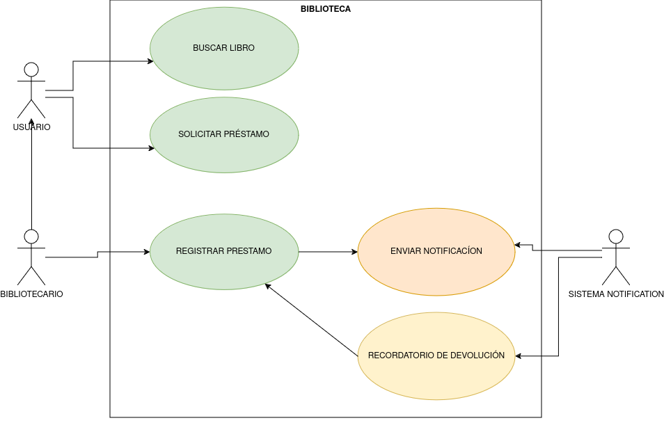

# Diagramas de uso

### Biblioteca

**Descripción**: El sistema de biblioteca permite a los usuarios buscar, solicitar prestado un libros y devolver libros, y al personal de la biblioteca gestionar el inventario de libros y registrar los prestamos de los usuarios. 

---

## Elementos del Diagrama de Casos de Uso

| Elemento                          | Descripción                                                                                          |
|-----------------------------------|------------------------------------------------------------------------------------------------------|
| **Actor: Usuario**                | Cliente de la biblioteca que busca y solicita libros.                                |
| **Actor: Bibliotecario**          | Personal de la biblioteca que registra y gestiona los préstamos de libros.           |
| **Caso de Uso: Buscar Libro**     | Permite al Usuario buscar libros en el catálogo.                                     |
| **Caso de Uso: Pedir prestado un libro** | Permite al Usuario solicitar el préstamo de un libro.                         |
| **Caso de Uso: Devolver libro** | Permite al Usuario solicitar devolver el libro del préstamo.                           |
| **Caso de Uso: Gestionar inventario de libros** | Permite al Bibliotecario gestionar el inventario de libros.            |
| **Caso de Uso: Registrar Préstamos** | Permite al Bibliotecario registrar el préstamo de un libro.                       |

---

## Relaciones entre los Elementos

| Relación                                          | Descripción                                                                                     |
|---------------------------------------------------|-------------------------------------------------------------------------------------------------|
| **Usuario → Buscar Libro**                        | Asociación: El Usuario interactúa con el sistema para buscar libros en el catálogo.             |
| **Usuario → Pedir prestado un libro**             | Asociación: El Usuario interactúa con el sistema para solicitar un préstamo de libro.           |
| **Usuario → Devolver libro**                      | Asociación: El Usuario interactúa con el sistema para solicitar la devolución de libro.         |
| **Bibliotecario → Gestionar inventario de libros**| Asociación: El Bibliotecario gestiona el inventario de libro.                                   |
| **Bibliotecario → Registrar Préstamo**            | Asociación: El Bibliotecario registra un préstamo cuando se solicita un libro.                  |

---

## Diagrama Completo

**Descripción Visual**: A continuación se representa el diagrama de casos de uso, con los actores y los casos de uso.

---

---

Este modelo de diagrama de casos de uso para un sistema de biblioteca ayuda a visualizar cómo interactúan los actores (Usuario, Bibliotecario) con las funcionalidades clave, y resalta los escenarios opcionales que extienden la funcionalidad básica.

### Compras en Línea

**Descripción**: El sistema de Compras en Línea permite a los clientes navegar por productos, agregarlos al carrito, realizar pedidos y pagar por ellos. El administrador gestiona los productos disponibles y sus precios.

---

## Elementos del Diagrama de Casos de Uso

| Elemento                          | Descripción                                                                                          |
|-----------------------------------|------------------------------------------------------------------------------------------------------|
| **Actor: Usuario**                | Cliente que busca productos, agrega productos al carrito, realiza pedidos y paga pedidos.            |
| **Actor: Administrador**          | Personal que gestiona los productos y los precios de estos.                          |
| **Caso de Uso: Buscar producto**     | Permite al Usuario buscar productos.                                                    |
| **Caso de Uso: Añadir producto al carrito** | Permite al Usuario añadir al su carrito un producto.                                            |
| **Caso de Uso: Realizar pedido** | Permite al Usuario realizar un pedido con los productos de su carrito.                                     |
| **Caso de Uso: Realizar pago** | Permite al Usuario realizar el pago de su pedido.                |
| **Caso de Uso: Gestión del catalogo de productos** | Permite al Administrador gestionar el catalogo de productos de la tienda.        |

---

## Relaciones entre los Elementos

| Relación                                          | Descripción                                                                                     |
|---------------------------------------------------|-------------------------------------------------------------------------------------------------|
| **Usuario → Buscar producto**                        | Asociación: El Usuario interactúa con el sistema para buscar productos en el catálogo.             |
| **Usuario → Añadir al carrito**                  | Asociación: El Usuario interactúa con el sistema para añadir un producto a su carrito.           |
| **Usuario → Realizar pedido**                  | Asociación: El Usuario interactúa con el sistema para realizar el pedido de los productos de su carrito.          |
| **Usuario → Registrar pago**            |  Asociación: El Usuario interactúa con el sistema para realizar el pago del pedido.          |
| **Administrador → Gestión del catalogo de productos**            | Asociación: El Administrador gestiona todo el contenido del catalogo de productos.             |

---

## Diagrama Completo

**Descripción Visual**: A continuación se representa el diagrama de casos de uso, con los actores y los casos de uso, y las relaciones de asociación, inclusión y extensión.

---

---
Este modelo de diagrama de casos de uso para un sistema de compras en línea ayuda a visualizar cómo interactúan los actores (Usuario, Administrador) con las funcionalidades clave.

### Gestión de Cursos en Línea

**Descripción**: Un sistema de gestión de cursos en línea permite a los estudiantes inscribirse en cursos, ver los materiales del curso y completar evaluaciones. Los profesores pueden crear y actualizar cursos, y calificar evaluaciones.

---

## Elementos del Diagrama de Casos de Uso

| Elemento                          | Descripción                                                                                          |
|-----------------------------------|------------------------------------------------------------------------------------------------------|
| **Actor: Estudiante**        | El estudiante puede inscribirse en cursos, visualizar el material y realizar evaluaciones.   |
| **Actor: Profesor**          | El profesor puede crear cursos, actualizar el contenido y calificar.       |
| **Caso de Uso: Inscribirse en curso**     | Permite al Estudiante inscribirse a un curso.            |
| **Caso de Uso: Ver material del curso**     | Permite al Estudiante ver el contenido del curso.            |
| **Caso de Uso: Realizar evaluación**     | Permite al Estudiante realizar evaluaciones.           |
| **Caso de Uso: Crear curso**     | Permite al Profesor crear cursos para los alumnos.          |
| **Caso de Uso: Calificar evaluaciones**     | Permite al Profesor evaluar evaluaciones de los alumnos.          |
| **Caso de Uso: Actualizar contenido del curso**     | Permite al Profesor actualizar el contenido de los cursos.        |

---

## Relaciones entre los Elementos

| Relación                                          | Descripción                                                                                     |
|---------------------------------------------------|-------------------------------------------------------------------------------------------------|
| **Estudiante → Inscribirse en curso**       | Asociación: El Estudiante interactúa con el sistema para inscribirse en un curso. |
| **Estudiante → Ver material del curso**      | Asociación: El Estudiante interactúa con el sistema para ver el material del curso.  |
| **Estudiante → Realizar evaluación**         | Asociación: El Estudiante interactúa con el sistema para realizar evaluaciones en el curso. |
| **Profesor → Calificar evaluación**          | Asociación: El Profesor interactúa con el sistema para calificar las evaluaciones de los Estudiantes.  |
| **Profesor → Crear curso**                   | Asociación: El Profesor interactúa con el sistema para crear cursos  |
| **Profesor → Actualizar contenido del curso**   | Asociación: El Profesor interactúa con el sistema para actualizar el contenido del curso.  |

---

## Diagrama Completo

**Descripción Visual**: A continuación se representa el diagrama de casos de uso, con los actores y los casos de uso, y las relaciones de asociación, inclusión y extensión.

---

---

Este modelo de diagrama de casos de uso para un sistema de de Cursos online ayuda a visualizar cómo interactúan los actores (Estudiante, Profesor) con las funcionalidades clave.

