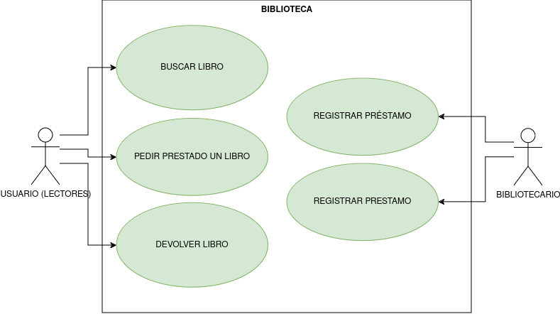

# Espesificación de diagramas de uso

## Biblioteca

**Descripción**: El sistema de biblioteca permite a los usuarios buscar, solicitar prestado un libros y devolver libros, y al personal de la biblioteca gestionar el inventario de libros y registrar los prestamos de los usuarios. 

---

## Actores

|  Actor | Lectores |
|---|---|
| Descripción  | _Persona que usa el sistema para buscar, pedir prestado y devolver libros._  |
| Características  | _Características que describen al actor_ |
| Relaciones | _Relaciones que tiene con otros actores. Básicamente cuando realiza las mismas acciones que otro actor._  |
| Referencias | _Que casos de uso realiza_ |   
|  Notas |  _Notas adicionales_ |
| Autor  | _Quien desarrolla la especificación del actor_ |
|Fecha | __ |

|  Actor | Bibliotecario |
|---|---|
| Descripción  | _Breve descripción del actor_  |
| Características  | _Características que describen al actor_ |
| Relaciones | _Relaciones que tiene con otros actores. Básicamente cuando realiza las mismas acciones que otro actor._  |
| Referencias | _Que casos de uso realiza_ |   
|  Notas |  _Notas adicionales_ |
| Autor  | _Quien desarrolla la especificación del actor_ |
|Fecha | _Fecha de la especificación_ |

## Casos de Usos

|  Caso de Uso	CU | Buscar libros |
  |---|---|
  | Fuentes  | _Documento que sustenta el caso de uso_  |
  | Actor  |  _Actores que participan en el caso de uso_ |
  | Descripción | _Descripción del caso de uso_  |
  | Flujo básico | _Descripción paso a paso de la ejecución. (1->2->3.)_ |
  | Pre-condiciones | _Que debe ocurrir con anterioridad_  |  
  | Post-condiciones  | _Que debe ocurrir con posterioridad_  |  
  |  Requerimientos | _Que debe de exister para que el caso de uso se ejecute. Ej: Tarjeta de crédito_  |
  |  Notas |  _Notas adicionales_ |
  | Autor  | _Quien desarrolla la especificación del actor_ |
  |Fecha | _Fecha de la especificación_ |

|  Caso de Uso	CU | Pedir prestado un libro |
  |---|---|
  | Fuentes  | _Documento que sustenta el caso de uso_  |
  | Actor  |  _Actores que participan en el caso de uso_ |
  | Descripción | _Descripción del caso de uso_  |
  | Flujo básico | _Descripción paso a paso de la ejecución. (1->2->3.)_ |
  | Pre-condiciones | _Que debe ocurrir con anterioridad_  |  
  | Post-condiciones  | _Que debe ocurrir con posterioridad_  |  
  |  Requerimientos | _Que debe de exister para que el caso de uso se ejecute. Ej: Tarjeta de crédito_  |
  |  Notas |  _Notas adicionales_ |
  | Autor  | _Quien desarrolla la especificación del actor_ |
  |Fecha | _Fecha de la especificación_ |

|  Caso de Uso	CU | Devolver libro |
  |---|---|
  | Fuentes  | _Documento que sustenta el caso de uso_  |
  | Actor  |  _Actores que participan en el caso de uso_ |
  | Descripción | _Descripción del caso de uso_  |
  | Flujo básico | _Descripción paso a paso de la ejecución. (1->2->3.)_ |
  | Pre-condiciones | _Que debe ocurrir con anterioridad_  |  
  | Post-condiciones  | _Que debe ocurrir con posterioridad_  |  
  |  Requerimientos | _Que debe de exister para que el caso de uso se ejecute. Ej: Tarjeta de crédito_  |
  |  Notas |  _Notas adicionales_ |
  | Autor  | _Quien desarrolla la especificación del actor_ |
  |Fecha | _Fecha de la especificación_ |

|  Caso de Uso	CU | Gestionar inventario de libro |
  |---|---|
  | Fuentes  | _Documento que sustenta el caso de uso_  |
  | Actor  |  _Actores que participan en el caso de uso_ |
  | Descripción | _Descripción del caso de uso_  |
  | Flujo básico | _Descripción paso a paso de la ejecución. (1->2->3.)_ |
  | Pre-condiciones | _Que debe ocurrir con anterioridad_  |  
  | Post-condiciones  | _Que debe ocurrir con posterioridad_  |  
  |  Requerimientos | _Que debe de exister para que el caso de uso se ejecute. Ej: Tarjeta de crédito_  |
  |  Notas |  _Notas adicionales_ |
  | Autor  | _Quien desarrolla la especificación del actor_ |
  |Fecha | _Fecha de la especificación_ |

|  Caso de Uso	CU | Registrar préstamo |
  |---|---|
  | Fuentes  | _Documento que sustenta el caso de uso_  |
  | Actor  |  _Actores que participan en el caso de uso_ |
  | Descripción | _Descripción del caso de uso_  |
  | Flujo básico | _Descripción paso a paso de la ejecución. (1->2->3.)_ |
  | Pre-condiciones | _Que debe ocurrir con anterioridad_  |  
  | Post-condiciones  | _Que debe ocurrir con posterioridad_  |  
  |  Requerimientos | _Que debe de exister para que el caso de uso se ejecute. Ej: Tarjeta de crédito_  |
  |  Notas |  _Notas adicionales_ |
  | Autor  | _Quien desarrolla la especificación del actor_ |
  |Fecha | _Fecha de la especificación_ |

---

---

### Compras en Línea

**Descripción**: El sistema de Compras en Línea permite a los clientes navegar por productos, agregarlos al carrito, realizar pedidos y pagar por ellos. El administrador gestiona los productos disponibles y sus precios.

---
## Actores

## Casos de Uso

|  Caso de Uso	CU | XXX  |
  |---|---|
  | Fuentes  | _Documento que sustenta el caso de uso_  |
  | Actor  |  _Actores que participan en el caso de uso_ |
  | Descripción | _Descripción del caso de uso_  |
  | Flujo básico | _Descripción paso a paso de la ejecución. (1->2->3.)_ |
  | Pre-condiciones | _Que debe ocurrir con anterioridad_  |  
  | Post-condiciones  | _Que debe ocurrir con posterioridad_  |  
  |  Requerimientos | _Que debe de exister para que el caso de uso se ejecute. Ej: Tarjeta de crédito_  |
  |  Notas |  _Notas adicionales_ |
  | Autor  | _Quien desarrolla la especificación del actor_ |
  |Fecha | _Fecha de la especificación_ |

---

---

### Gestión de Cursos en Línea

**Descripción**: Un sistema de gestión de cursos en línea permite a los estudiantes inscribirse en cursos, ver los materiales del curso y completar evaluaciones. Los profesores pueden crear y actualizar cursos, y calificar evaluaciones.

---

---

---

